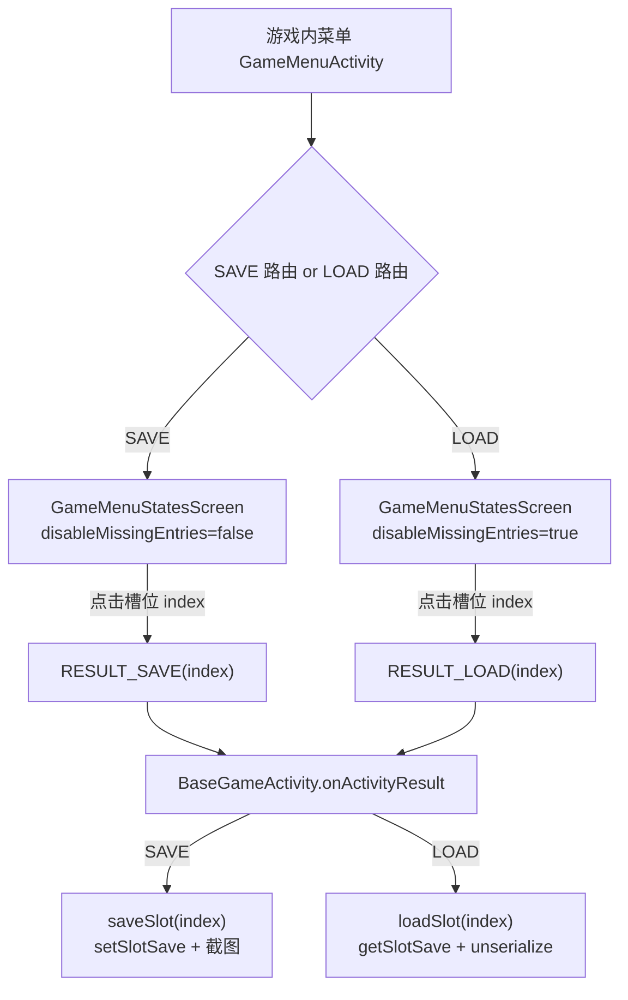
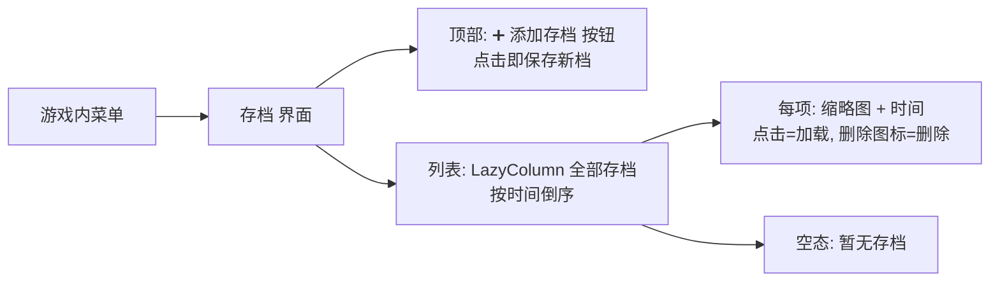

# 存档系统改造设计方案：不限插槽 + 点击即添加

> 目标：将现有**固定 4 个存档插槽**的保存/加载模型，改造为**数量不限、点击"添加"即保存**的动态存档列表，
> 用户无需先选择插槽再保存；加载时以可滚动列表展示全部存档，并支持删除管理。
>
> 本文档为**设计与工作量评估**，不包含任何代码改动。

---

## 1. 背景与目标

### 1.1 需求描述

- **现状**：游戏内菜单的"保存/加载"固定提供 **4 个插槽**（State 1~4），保存时必须先选择一个插槽（覆盖式写入）。
- **期望**：
  1. 存档数量**不限**；
  2. 保存时**点击"添加"直接生成一个新存档**，无需选择插槽；
  3. （隐含）加载时以列表展示全部存档，并可**删除**以管理数量。

### 1.2 影响面判断

| 维度 | 结论 |
|------|------|
| 存储格式 | **需变更**（固定 slot 索引 → 动态唯一 ID） |
| 向后兼容 | **必须处理**（现有用户的 slot1~4 存档不能丢失） |
| 交互协议 | 需变更（Intent 从传 index → 传存档 ID） |
| UI | 移动端（Compose）+ TV 端（Preference）**两套都要改** |
| 不受影响 | auto-save（`.state`）、quick-save（内存）、SRAM、[`SavesCoherencyEngine`](../retrograde-app-shared/src/main/java/com/swordfish/lemuroid/lib/saves/SavesCoherencyEngine.kt)（仅处理 auto-save 与 SRAM 一致性） |

> **复杂度提示**：本需求触及**存储模型 + 交互模型的双重变更**，并涉及数据迁移，
> 复杂度**高于**连发（Turbo）功能。

---

## 2. 现状分析：存档链路

### 2.1 存储层

[`StatesManager`](../retrograde-app-shared/src/main/java/com/swordfish/lemuroid/lib/saves/StatesManager.kt) 是核心，关键点：

```kotlin
const val MAX_STATES = 4                                    // 第 151 行，硬编码上限
assert(index in 0 until MAX_STATES)                         // 第 23、33 行，索引强约束
private fun getSlotSaveFileName(game, index) =
    "${game.fileName}.slot${index + 1}"                     // 第 145–148 行，文件名绑定槽位
suspend fun getSavedSlotsInfo(...) =
    (0 until MAX_STATES).map { ... SaveInfo(exists, date) } // 第 62–71 行，固定遍历 4 个
```

**文件布局**（目录 `{statesDir}/{coreName}/`）：

| 文件 | 命名 | 内容 |
|------|------|------|
| 存档状态 | `{game.fileName}.slot{n}` | 压缩的状态字节流 |
| 存档元数据 | `{game.fileName}.slot{n}.metadata` | JSON：`diskIndex`、`version` |
| 预览截图 | `{game.fileName}.slot{n}.jpg`（见 [`StatesPreviewManager`](../retrograde-app-shared/src/main/java/com/swordfish/lemuroid/lib/saves/StatesPreviewManager.kt)） | JPEG 缩略图 |
| 自动存档 | `{game.fileName}.state` | 与 slot 独立，不受影响 |

### 2.2 数据模型

```kotlin
class SaveState(val state: ByteArray, val metadata: Metadata)  // SaveState.kt
    data class Metadata(val diskIndex: Int = 0, val version: Int = 0)
data class SaveInfo(val exists: Boolean, val date: Long)       // SaveInfo.kt
```

### 2.3 交互流程



**关键代码位置：**

| 环节 | 文件 | 说明 |
|------|------|------|
| 菜单路由/回调 | [`GameMenuActivity.kt`](../lemuroid-app/src/main/java/com/swordfish/lemuroid/app/mobile/feature/gamemenu/GameMenuActivity.kt) 第 187–220 行 | SAVE/LOAD 两个 composable |
| Intent 协议 | [`GameMenuContract.kt`](../lemuroid-app/src/main/java/com/swordfish/lemuroid/app/shared/GameMenuContract.kt) 第 17–18 行 | `RESULT_SAVE`/`RESULT_LOAD` 传 index |
| 结果分发 | [`BaseGameActivity.kt`](../lemuroid-app/src/main/java/com/swordfish/lemuroid/app/shared/game/BaseGameActivity.kt) 第 373–382 行 | `getIntExtra(...)` |
| 运行时读写 | [`GameViewModelSaves.kt`](../lemuroid-app/src/main/java/com/swordfish/lemuroid/app/shared/game/viewmodel/GameViewModelSaves.kt) 第 42–71 行 | `saveSlot`/`loadSlot` |
| 移动端列表 UI | [`GameMenuStatesScreen.kt`](../lemuroid-app/src/main/java/com/swordfish/lemuroid/app/mobile/feature/gamemenu/states/GameMenuStatesScreen.kt) | `Column + verticalScroll` |
| 移动端 VM | [`GameMenuStatesViewModel.kt`](../lemuroid-app/src/main/java/com/swordfish/lemuroid/app/mobile/feature/gamemenu/states/GameMenuStatesViewModel.kt) 第 48–75 行 | `getSavedSlotsInfo` → 4 个 entry |
| TV 端 UI | [`TVGameMenuFragment.kt`](../lemuroid-app/src/main/java/com/swordfish/lemuroid/app/tv/gamemenu/TVGameMenuFragment.kt) 第 96–124 行 | PreferenceScreen `forEachIndexed` |
| 描述/预览 | [`GameMenuHelper.kt`](../lemuroid-app/src/main/java/com/swordfish/lemuroid/app/shared/gamemenu/GameMenuHelper.kt) 第 224–244 行 | 日期描述 + 缩略图 |

### 2.4 关键约束（决定改造成本）

1. **`MAX_STATES = 4` 深植于命名与遍历逻辑**：文件名、`getSavedSlotsInfo` 遍历、`assert` 校验、预览命名全部依赖固定索引。
2. **index 贯穿全链路**：从 UI → Intent → ViewModel → StatesManager，均以 `Int index` 为标识。改为动态 ID 需**全链路替换**。
3. **无删除功能**：当前没有任何删除存档的能力（全局搜索确认），"不限数量"必须**新增删除**，否则存档无限膨胀。
4. **固定 4 项 UI**：移动端用 `Column + verticalScroll`（非懒加载），数量不限后需换 `LazyColumn` 并做缩略图懒加载。

---

## 3. 目标交互设计



- **保存**：进入"存档"界面点"添加存档"，或直接一个动作即生成新档（无需选槽）。
- **加载**：点击列表中任一存档。
- **删除**：列表项提供删除入口（不限数量的必要管理能力）。
- **排序**：按创建时间**倒序**（最新在最前），符合直觉。

---

## 4. 方案选型

### 方案 A：动态不限存档（推荐 ✅）

以**时间戳**作为存档唯一 ID，文件名改为 `{game.fileName}.{timestamp}.state`，目录扫描得到全部存档，真正不限数量。

### 方案 B：提高上限 + 自动追加（MVP，折中）

保留 slot 文件机制，将 `MAX_STATES` 提高到较大值（如 20/50），"保存"时自动写入第一个空槽。

| 对比项 | 方案 A（动态不限） | 方案 B（提高上限） |
|--------|------------------|------------------|
| 是否真正"不限" | ✅ 是 | ❌ 仍有上限 |
| 向后兼容 | 需迁移/双读逻辑 | ✅ 天然兼容（旧 slot 仍有效） |
| 存储改造量 | 大 | 小 |
| UI 改造量 | 大（LazyColumn+删除） | 中 |
| 工作量 | **9–14 人天** | **3–5 人天** |
| 契合需求 | 完全 | 部分 |

> **建议**：若追求完全满足需求 → 方案 A；若先快速改善体验、控制风险 → 方案 B 作为过渡。

---

## 5. 详细设计（方案 A）

### 5.1 存储模型：时间戳作为唯一 ID

| 项 | 旧 | 新 |
|----|----|----|
| 标识 | `index: Int (0..3)` | `id: Long (timestamp)` |
| 状态文件 | `{name}.slot{n}` | `{name}.{ts}.state` |
| 元数据 | `{name}.slot{n}.metadata` | `{name}.{ts}.metadata` |
| 预览 | `{name}.slot{n}.jpg` | `{name}.{ts}.jpg` |

- 时间戳天然唯一、天然可排序；目录扫描 `{name}.*.state` 即得全部存档。
- 同毫秒冲突极罕见，可加随机后缀兜底。
- `SaveInfo.date` 仍来自 `file.lastModified()`，无需额外索引文件。

### 5.2 存储层改造（StatesManager）

| 方法 | 改造 |
|------|------|
| `MAX_STATES` | 移除 |
| `assert(index in 0 until MAX_STATES)` | 移除 |
| `getSavedSlotsInfo()` | → `getAllSaves(): List<SaveEntry>`，扫描目录动态返回，按时间倒序 |
| `getSlotSave(index)` | → `getSave(id: Long)` |
| `setSlotSave(index)` | → `addSave(saveState): Long`（生成 ts、写入、返回 id） |
| — | **新增** `deleteSave(id)`：同步删除 state/metadata/jpg |
| — | **新增** 兼容读取旧 `.slot{n}`（见 §5.8） |

### 5.3 预览层改造（StatesPreviewManager）

- `getPreviewForSlot(index)` / `setPreviewForSlot(index)` → 改为按 `id` 命名。
- 删除存档时同步删除对应 `.jpg`，避免孤儿文件。

### 5.4 数据模型

```kotlin
// 建议新增：一个存档条目的完整视图
data class SaveEntry(
    val id: Long,            // 时间戳
    val exists: Boolean,
    val date: Long,          // 最后修改时间
)
```

### 5.5 运行时改造（GameViewModelSaves）

- `saveSlot(index)` → `addSave()`：生成新存档 + 截图。
- `loadSlot(index)` → `loadSave(id)`。
- **新增** `deleteSave(id)`。
- 截图 `takeScreenshotPreview(index)` → 按 id 命名。

### 5.6 交互协议改造（GameMenuContract / Intent）

| 常量 | 改造 |
|------|------|
| `RESULT_SAVE` | 不再需要 index（点击添加即触发 `addSave`） |
| `RESULT_LOAD` | 携带 **`id: Long`**（原为 index Int） |
| `RESULT_DELETE`（新增） | 携带 `id: Long` |

- [`BaseGameActivity`](../lemuroid-app/src/main/java/com/swordfish/lemuroid/app/shared/game/BaseGameActivity.kt) 第 373–382 行分发逻辑相应改为 `getLongExtra`。
- [`GameMenuHelper.handleLoadAction`](../lemuroid-app/src/main/java/com/swordfish/lemuroid/app/shared/gamemenu/GameMenuHelper.kt) 第 204–214 行同步。

### 5.7 UI 改造

**移动端**（[`GameMenuStatesScreen`](../lemuroid-app/src/main/java/com/swordfish/lemuroid/app/mobile/feature/gamemenu/states/GameMenuStatesScreen.kt) + [`ViewModel`](../lemuroid-app/src/main/java/com/swordfish/lemuroid/app/mobile/feature/gamemenu/states/GameMenuStatesViewModel.kt)）：
- `Column + verticalScroll` → `LazyColumn`（应对大量存档）。
- 顶部新增"➕ 添加存档"按钮。
- 每项增加删除入口（图标或长按菜单 + 二次确认）。
- 缩略图懒加载（避免一次性解码大量 Bitmap 造成卡顿/OOM）。
- 新增空态展示。
- `StateEntry` 增加 `id` 字段；`onStateClicked(index)` → `onStateClicked(id)`。

**TV 端**（[`TVGameMenuFragment`](../lemuroid-app/src/main/java/com/swordfish/lemuroid/app/tv/gamemenu/TVGameMenuFragment.kt) 第 96–124 行）：
- PreferenceScreen 动态生成条目（数量不再固定），新增"添加存档"与"删除"偏好项，遥控器焦点适配。

### 5.8 向后兼容与迁移（最高风险项）

现有用户的 `slot1~4` 存档必须可用。两种策略：

- **策略 1（双读，低风险）**：`getAllSaves()` 扫描时**同时识别**旧 `.slot{n}` 与新 `.{ts}.state`，
  旧档以只读方式并入列表（id 用特殊区间标记）；加载走兼容分支；不做文件迁移。
- **策略 2（一次性迁移，更干净）**：首次启动新版本时，将 `slot{n}` 按其 `lastModified` 重命名为 `.{ts}.state`
  （含 metadata、jpg），之后统一走新逻辑。需保证迁移的**原子性与幂等**（中断可重试、不重复迁移）。

> 推荐 **策略 2**（长期更干净），但必须充分测试中断/失败场景；若求稳可先上策略 1。

### 5.9 删除功能（新增能力）

- 存储层 `deleteSave(id)`：删除 state + metadata + jpg 三个文件。
- UI：删除入口 + **二次确认弹窗**（防误删）。
- 边界：删除当前正在加载的存档、删除后列表刷新。

---

## 6. 文件级改动清单

| # | 文件 | 类型 | 内容 |
|---|------|------|------|
| 1 | [`StatesManager.kt`](../retrograde-app-shared/src/main/java/com/swordfish/lemuroid/lib/saves/StatesManager.kt) | 重构 | 移除 MAX_STATES；动态扫描；add/get/delete by id；兼容旧 slot |
| 2 | [`StatesPreviewManager.kt`](../retrograde-app-shared/src/main/java/com/swordfish/lemuroid/lib/saves/StatesPreviewManager.kt) | 修改 | 预览按 id 命名；删除同步 |
| 3 | [`SaveInfo.kt`](../retrograde-app-shared/src/main/java/com/swordfish/lemuroid/lib/saves/SaveInfo.kt) / 新增 `SaveEntry.kt` | 修改/新增 | 引入带 id 的存档条目模型 |
| 4 | [`GameViewModelSaves.kt`](../lemuroid-app/src/main/java/com/swordfish/lemuroid/app/shared/game/viewmodel/GameViewModelSaves.kt) | 修改 | `addSave`/`loadSave(id)`/`deleteSave(id)` |
| 5 | [`BaseGameScreenViewModel.kt`](../lemuroid-app/src/main/java/com/swordfish/lemuroid/app/shared/game/BaseGameScreenViewModel.kt) 第 240–252 行 | 修改 | 透传 id 版本 save/load/delete |
| 6 | [`GameMenuContract.kt`](../lemuroid-app/src/main/java/com/swordfish/lemuroid/app/shared/GameMenuContract.kt) | 修改 | RESULT_LOAD 传 id；新增 RESULT_DELETE |
| 7 | [`BaseGameActivity.kt`](../lemuroid-app/src/main/java/com/swordfish/lemuroid/app/shared/game/BaseGameActivity.kt) 第 373–382 行 | 修改 | `getLongExtra` 分发；处理删除 |
| 8 | [`GameMenuHelper.kt`](../lemuroid-app/src/main/java/com/swordfish/lemuroid/app/shared/gamemenu/GameMenuHelper.kt) | 修改 | handleLoad/Save/Delete by id |
| 9 | [`GameMenuStatesScreen.kt`](../lemuroid-app/src/main/java/com/swordfish/lemuroid/app/mobile/feature/gamemenu/states/GameMenuStatesScreen.kt) | 重构 | LazyColumn + 添加按钮 + 删除 + 空态 |
| 10 | [`GameMenuStatesViewModel.kt`](../lemuroid-app/src/main/java/com/swordfish/lemuroid/app/mobile/feature/gamemenu/states/GameMenuStatesViewModel.kt) | 重构 | 动态列表；StateEntry 带 id |
| 11 | [`GameMenuActivity.kt`](../lemuroid-app/src/main/java/com/swordfish/lemuroid/app/mobile/feature/gamemenu/GameMenuActivity.kt) 第 187–220 行 | 修改 | SAVE/LOAD 路由回调改为 id；合并存档界面（可选） |
| 12 | [`TVGameMenuFragment.kt`](../lemuroid-app/src/main/java/com/swordfish/lemuroid/app/tv/gamemenu/TVGameMenuFragment.kt) | 重构 | TV 端动态列表 + 添加/删除 |
| 13 | `res/values/strings.xml` + 30+ 语言 | 新增 | "添加存档""删除存档""确认删除""暂无存档"等文案 |
| 14 | 迁移逻辑（新增，位置随策略） | 新增 | 旧 slot → 时间戳 迁移/兼容读取 |

> **改动集中度**：存储层（#1 #2 #14）与 UI（#9 #10 #12）是主要工作量；协议与运行时（#4~#8）为连带改造。

---

## 7. 边界与风险

| 风险 | 说明 | 应对 |
|------|------|------|
| **数据迁移丢失**（最高） | 旧 slot1~4 存档迁移失败导致用户进度丢失 | 迁移原子+幂等；失败回退；先备份；灰度 |
| **孤儿文件** | 删除存档未清理 metadata/jpg | `deleteSave` 三文件同步删除 |
| **大量存档性能** | 几十上百档时扫描/缩略图解码卡顿、OOM | LazyColumn + 缩略图懒加载 + 缓存 |
| **时间戳冲突** | 同毫秒创建两个存档 | 加随机后缀或序列号兜底 |
| **版本兼容** | `SaveState.Metadata.version` 校验（[loadSaveState](../lemuroid-app/src/main/java/com/swordfish/lemuroid/app/shared/game/viewmodel/GameViewModelSaves.kt) 第 147 行） | 迁移时保留原 metadata |
| **跨端一致性** | 移动端与 TV 端两套 UI | 共用存储/VM 层，UI 分别适配 |
| **误删** | 用户误删重要存档 | 二次确认弹窗 |

---

## 8. 工作量评估

### 方案 A（动态不限，推荐）

| 任务 | 人天 |
|------|------|
| 存储层重构（动态 ID、扫描、增删改） | 2–3 |
| 数据模型 + **向后兼容/迁移** | 1.5–2.5 |
| 运行时 + Intent 协议（save/load/delete by id） | 1–1.5 |
| 移动端 UI 重构（LazyColumn + 添加 + 删除 + 空态 + 懒加载） | 2–3 |
| TV 端 UI 重构 | 1–2 |
| 多语言文案 | 0.5 |
| 测试（迁移兼容、性能、删除、排序、跨端） | 2–3 |
| **合计** | **约 9–14 人天（2–3 周）** |

### 方案 B（提高上限 + 自动追加，MVP）

| 任务 | 人天 |
|------|------|
| 提高 MAX_STATES + 自动选空槽保存 | 0.5–1 |
| UI 微调（保存改为"添加"语义） | 1–1.5 |
| 删除功能（可选） | 1 |
| 测试（旧档兼容天然） | 1 |
| **合计** | **约 3–5 人天** |

---

## 9. 分阶段实施计划


- **阶段 0**：快速缓解"4 个不够用"，风险低、天然兼容。
- **阶段 1–3**：实现真正"不限 + 点击添加 + 删除"，其中**迁移兼容**需重点测试。

---

## 10. 测试要点

1. **迁移兼容**：升级后旧 slot1~4 存档可见、可加载、预览正常；迁移中断可重试不丢档。
2. **点击添加**：连续添加多个存档，数量不受限，按时间倒序展示。
3. **加载**：点击任意存档正确恢复（含多磁盘 `diskIndex`、版本校验）。
4. **删除**：删除后 state/metadata/jpg 三文件均清除，列表刷新，无误删（二次确认）。
5. **性能**：50~100 个存档时列表滚动流畅、缩略图不 OOM。
6. **跨端**：移动端与 TV 端行为一致。
7. **隔离性**：auto-save / quick-save / SRAM 不受影响。
8. **多游戏/多核心**：不同 game、不同 core 存档互不干扰（目录按 coreName 隔离）。

---

## 附录：关键符号速查

| 符号 | 位置 | 用途 |
|------|------|------|
| `StatesManager.MAX_STATES = 4` | `StatesManager.kt` 第 151 行 | 固定上限（需移除） |
| `getSavedSlotsInfo()` | `StatesManager.kt` 第 62–71 行 | 固定遍历（需改动态扫描） |
| `getSlotSaveFileName()` | `StatesManager.kt` 第 145–148 行 | slot 命名（需改时间戳） |
| `saveSlot/loadSlot(index)` | `GameViewModelSaves.kt` 第 42–71 行 | 运行时读写 |
| `RESULT_SAVE/RESULT_LOAD` | `GameMenuContract.kt` 第 17–18 行 | Intent 协议 |
| `disableMissingEntries` | `GameMenuStatesViewModel.kt` | 区分 SAVE/LOAD 模式 |

---

*文档版本：v1.0 ｜ 仅设计评估，不含代码改动 ｜ 关联需求：见 [turbo-fire-design.md](./turbo-fire-design.md)*
