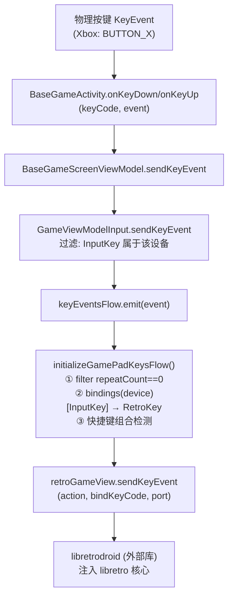
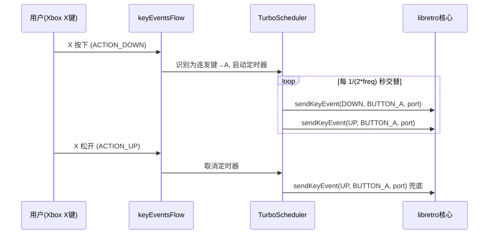
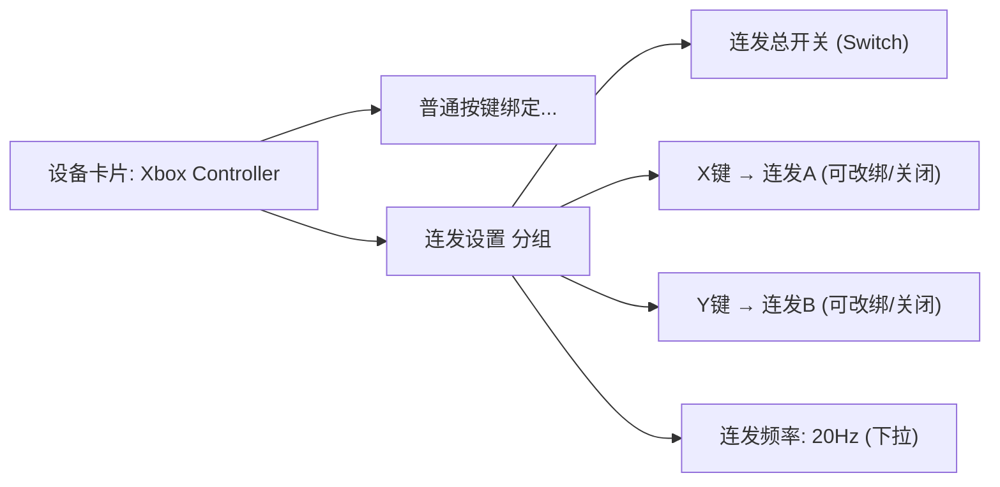
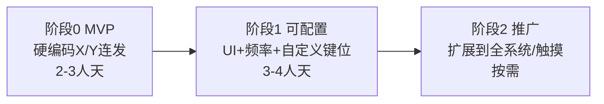

# FC 手柄连发（Turbo）功能设计方案

> 目标：为 FC/NES 模拟器增加"连发键"能力——当使用 **Xbox Wireless Controller** 等外接手柄时，
> 可将 **X、Y** 物理按键设置为 **A、B** 的连发（Turbo / 自动连打）键，复刻经典 FC 连发手柄体验。
>
> 本文档为**设计与工作量评估**，不包含任何代码改动。

---

必须原则：独立封装组件，保证可维护性、可扩展性、去除无用代码，代码极致复用

## 1. 背景与目标

### 1.1 需求描述

- 经典 FC（红白机）手柄带有"连发"功能：按住连发键，等效于快速反复点按对应的 A/B 键。
- NES 游戏（如射击、动作类）中，连发能显著降低操作疲劳。
- 用户希望在连接 **Xbox Wireless Controller** 时，把 **X 键 = 连发 A**、**Y 键 = 连发 B**，并且可以设置（开关/频率/自定义）。

### 1.2 有利前提：X/Y 在 NES 上天然空闲

- NES/FC 只使用 **A、B、Start、Select** 四个功能键，**不消费 RetroPad 的 X/Y**。
- 当前默认绑定中，Xbox 的 X/Y 被互换映射到 RetroPad 的 X/Y
  （见 [`LemuroidInputDeviceGamePad.getDefaultBindings()`](../lemuroid-app/src/main/java/com/swordfish/lemuroid/app/shared/input/lemuroiddevice/LemuroidInputDeviceGamePad.kt) 第 28–29 行），
  这些键在 NES 核心里没有任何作用。
- **结论**：把 X/Y 复用为连发键，不会与正常游戏按键冲突，是天然合理的设计。

### 1.3 范围界定

| 项目 | 本方案范围 |
|------|-----------|
| 目标平台 | 外接物理手柄（Xbox Wireless Controller 优先） |
| 目标系统 | 首阶段仅 FC/NES（核心 FCEUmm），架构上可推广到其他系统 |
| 触摸按键连发 | **不在本方案范围**（触摸走独立链路，见 §2.3） |
| 连发键位 | 可配置，默认 X→A、Y→B |
| 连发频率 | 可配置（建议 15–30 Hz） |

---

## 2. 现状分析：输入链路

### 2.1 物理手柄按键链路（核心）



**关键代码位置：**

| 环节 | 文件 | 说明 |
|------|------|------|
| 系统按键入口 | [`BaseGameActivity.kt`](../lemuroid-app/src/main/java/com/swordfish/lemuroid/app/shared/game/BaseGameActivity.kt) 第 277–295 行 | `onKeyDown`/`onKeyUp` |
| 转发 | [`BaseGameScreenViewModel.kt`](../lemuroid-app/src/main/java/com/swordfish/lemuroid/app/shared/game/BaseGameScreenViewModel.kt) 第 320–324 行 | `sendKeyEvent` |
| **运行时处理（改造重点）** | [`GameViewModelInput.kt`](../lemuroid-app/src/main/java/com/swordfish/lemuroid/app/shared/game/viewmodel/GameViewModelInput.kt) 第 281–337 行 | `initializeGamePadKeysFlow()` |
| 按键映射/存储 | [`InputDeviceManager.kt`](../lemuroid-app/src/main/java/com/swordfish/lemuroid/app/shared/input/InputDeviceManager.kt) | `Map<InputKey, RetroKey>`，SharedPreferences+JSON |
| 默认绑定 | [`LemuroidInputDeviceGamePad.kt`](../lemuroid-app/src/main/java/com/swordfish/lemuroid/app/shared/input/lemuroiddevice/LemuroidInputDeviceGamePad.kt) | Xbox A↔B、X↔Y 互换 |
| 核心注入接口 | `com.swordfish.libretrodroid.GLRetroView#sendKeyEvent(action, keyCode, port)` | 外部库，不可改 |

### 2.2 关键约束（决定实现方式）

1. **`libretrodroid` 是外部 Maven 依赖**（v0.13.2，见 [`deps.kt`](../buildSrc/src/main/java/deps.kt) 第 26 行），
   **核心按键处理逻辑不在本工程内，无法修改**。但它暴露的 `sendKeyEvent(action, keyCode, port)`
   允许 App 层在**任意时刻主动注入按键**——这是软件连发的实现基础。

2. **系统自动重复被显式过滤**：运行时 [`filter { it.repeatCount == 0 }`](../lemuroid-app/src/main/java/com/swordfish/lemuroid/app/shared/game/viewmodel/GameViewModelInput.kt)（第 287 行）
   丢弃了 Android 的按键 auto-repeat。**因此不能依赖系统重复事件实现连发，必须由 App 自己生成 down/up 交替序列。**

3. **`distinctUntilChanged()` 去重**：第 289 行对 `(device, action, keyCode)` 三元组去重，
   连发所需的重复 down/up 会被吞掉，**改造时需绕开**。

4. **快捷键组合检测**：第 320–330 行用 `pressedKeys` 做组合键判断（MENU/QUICK_SAVE 等），
   连发逻辑需与之协调，避免误触发。

### 2.3 触摸按键链路（独立，不在范围内）

触摸按键走 [`GameViewModelTouchControls.handleVirtualInputButton()`](../lemuroid-app/src/main/java/com/swordfish/lemuroid/app/shared/game/viewmodel/GameViewModelTouchControls.kt) 第 171–173 行，
调用**无 port 参数**的 `sendKeyEvent(action, id)`，与物理手柄链路完全独立。
若未来要做触摸连发，需另行设计（PadKit 层）。

### 2.4 现有可复用机制

- **绑定持久化**：`InputDeviceManager` 已有成熟的 `FlowSharedPreferences` + `kotlinx.serialization` 方案，
  连发配置可直接复用同一套存储范式。
- **绑定 UI 流程**：[`GamePadBindingActivity`](../lemuroid-app/src/main/java/com/swordfish/lemuroid/app/mobile/feature/input/GamePadBindingActivity.kt)
  + [`InputBindingUpdater`](../lemuroid-app/src/main/java/com/swordfish/lemuroid/app/shared/input/InputBindingUpdater.kt) 提供了"按键捕获→写入"的完整范式，可扩展为"连发键捕获"。
- **设置页范式**：[`InputDevicesSettingsScreen`](../lemuroid-app/src/main/java/com/swordfish/lemuroid/app/mobile/feature/settings/inputdevices/InputDevicesSettingsScreen.kt)
  已有 `LemuroidSettingsSwitch` / `LemuroidSettingsMenuLink` 组件，新增连发设置项成本低。
- **快进开关先例**：`GameShortcutType.TOGGLE_FAST_FORWARD` 证明"运行时切换型功能"已有落地范式。

---

## 3. 方案选型

### 方案 A：暴露核心 turbo option（否决）

FCEUmm 核心自身带有 `fceumm_turbo_enable` / `fceumm_turbo_delay` 等选项，理论上可通过
[`CoreVariablesManager`](../retrograde-app-shared/src/main/java/com/swordfish/lemuroid/lib/core/CoreVariablesManager.kt) + `ExposedSetting` 暴露。

**否决原因：**
- 核心 turbo 模型是**固定的**，无法让用户把 Xbox 的 X/Y **自由指定**为 A/B 的连发键。
- 每个核心的 turbo 选项名/语义不一致，无法统一，扩展性差。
- 依赖具体核心实现，换核心即失效。

### 方案 B：App 层软件连发注入（采纳）✅

在 [`GameViewModelInput`](../lemuroid-app/src/main/java/com/swordfish/lemuroid/app/shared/game/viewmodel/GameViewModelInput.kt) 拦截连发键，
按住时启动定时器周期性交替发送 `sendKeyEvent(DOWN)` / `sendKeyEvent(UP)` 到核心。

**优点：** 完全可控、核心无关、可自由映射任意物理键到任意 RetroKey、频率可调、易推广到所有系统。

---

## 4. 详细设计

### 4.1 数据模型

新增连发配置模型（建议放在 `app/shared/input` 包）：

```kotlin
// 单条连发绑定：物理键 turboInputKey → 连发目标 retroKey
data class TurboBinding(
    val turboInputKey: InputKey,   // 触发连发的物理键（如 BUTTON_X）
    val targetRetroKey: RetroKey,  // 连发注入的目标键（如 BUTTON_A）
    val frequencyHz: Int = 20,     // 连发频率，默认 20Hz
)

// 每个设备一份连发配置
data class TurboConfig(
    val enabled: Boolean = false,               // 连发总开关
    val bindings: List<TurboBinding> = emptyList(),
)
```

> 说明：与现有 `Map<InputKey, RetroKey>`（普通映射）分开存储，避免语义混淆。
> 一个物理键要么走普通映射，要么走连发映射，UI 层需保证互斥。

### 4.2 配置存储（扩展 InputDeviceManager）

复用现有 SharedPreferences + JSON 序列化范式：

| 新增能力 | 说明 |
|---------|------|
| `getTurboConfigObservable(device): Flow<TurboConfig>` | 响应式读取，供运行时 combine |
| `suspend updateTurboConfig(device, TurboConfig)` | 写入 |
| `computeTurboPreference(device)` | 存储 key：`pref_key_gamepad_turbo_{descriptor}` |
| `resetAllBindings()` 扩展 | 一并清理 turbo 配置 |

### 4.3 运行时连发注入（核心改造）

改造 [`initializeGamePadKeysFlow()`](../lemuroid-app/src/main/java/com/swordfish/lemuroid/app/shared/game/viewmodel/GameViewModelInput.kt)，
在现有 `combine(...)` 中加入 turbo 配置流，并引入一个**连发调度器**。



**调度器伪代码：**

```kotlin
class TurboScheduler(private val scope: CoroutineScope) {
    // key = (deviceId, turboKeyCode)，value = 正在运行的连发任务
    private val jobs = mutableMapOf<Pair<Int, Int>, Job>()

    fun start(deviceId: Int, turboKey: Int, targetRetroKey: Int, port: Int, freqHz: Int) {
        val key = deviceId to turboKey
        if (jobs.containsKey(key)) return          // 幂等，避免重复启动
        jobs[key] = scope.launch {
            val halfPeriod = (1000L / freqHz) / 2  // 半个周期(ms)
            while (isActive) {
                retroGameView.sendKeyEvent(ACTION_DOWN, targetRetroKey, port)
                delay(halfPeriod)
                retroGameView.sendKeyEvent(ACTION_UP, targetRetroKey, port)
                delay(halfPeriod)
            }
        }
    }

    fun stop(deviceId: Int, turboKey: Int, targetRetroKey: Int, port: Int) {
        jobs.remove(deviceId to turboKey)?.cancel()
        // 兜底：确保目标键处于松开状态，防止"卡键"
        retroGameView.sendKeyEvent(ACTION_UP, targetRetroKey, port)
    }

    fun stopAll() { jobs.keys.toList().forEach { /* cancel + 兜底 UP */ } }
}
```

**在 `initializeGamePadKeysFlow()` 中的接入逻辑（要点）：**

1. 在 `combine` 中加入 `inputDeviceManager.getTurboConfigObservable()`。
2. 收到按键事件后，先查该 `(device, keyCode)` 是否为**已启用的连发键**：
   - **是** + `ACTION_DOWN` → 调用 `TurboScheduler.start(...)`，**不**走原 `sendKeyEvent` 单次注入。
   - **是** + `ACTION_UP` → 调用 `TurboScheduler.stop(...)`。
   - **否** → 走原有逻辑（普通映射注入 + 快捷键检测）。
3. **绕过 `repeatCount == 0` 与 `distinctUntilChanged()`**：连发键的判定需在过滤前分流，或由调度器自行产生事件（推荐后者，物理键只需捕获首次 down / 最终 up）。
4. **生命周期兜底**：在 `onPause` / `onStop` / 菜单弹出 / 设备断开时调用 `stopAll()`，防止连发卡死。

### 4.4 连发频率与时序设计

| 参数 | 建议值 | 说明 |
|------|--------|------|
| 默认频率 | 20 Hz | 每秒 20 次点按，接近经典 FC 连发手感 |
| 可选范围 | 10 / 15 / 20 / 30 Hz | 档位式，避免自由输入 |
| 定时器实现 | 协程 `delay` | 复用现有 `scope`，无需额外线程 |
| 半周期 | `1000/freq/2` ms | down 与 up 各占半周期 |

> 注意：libretro 每帧 poll 一次输入（约 60fps ≈ 16.6ms/帧）。频率过高（>30Hz）时，
> down/up 可能落在同一帧内被核心合并而"丢拍"，故建议上限 30Hz。

### 4.5 设置 UI 设计

在 [`InputDevicesSettingsScreen`](../lemuroid-app/src/main/java/com/swordfish/lemuroid/app/mobile/feature/settings/inputdevices/InputDevicesSettingsScreen.kt) 的每个设备卡片下，新增"连发设置"区块：



- **总开关**：`LemuroidSettingsSwitch`。
- **连发键位**：复用 `GamePadBindingActivity` 捕获流程，新增一种 "turbo binding" 意图。
- **频率**：下拉/单选。
- **互斥校验**：设为连发键的物理键，应从普通绑定列表移除或标注，避免同一键双重语义。

### 4.6 生效范围控制

- **首阶段**：仅当 `system.id == SystemID.NES` 时启用连发调度（在运行时按当前系统开关）。
- UI 层可选择"始终显示"或"仅 NES 显示"，建议**始终可配置、运行时按系统生效**，为后续推广留口。

---

## 5. 文件级改动清单

| # | 文件 | 改动类型 | 具体内容 |
|---|------|---------|---------|
| 1 | `app/shared/input/TurboBinding.kt` **(新增)** | 新建 | `TurboBinding` / `TurboConfig` 数据模型 |
| 2 | [`InputDeviceManager.kt`](../lemuroid-app/src/main/java/com/swordfish/lemuroid/app/shared/input/InputDeviceManager.kt) | 修改 | 新增 turbo 配置的读/写/observe/reset 方法 + 存储 key |
| 3 | `app/shared/game/viewmodel/TurboScheduler.kt` **(新增)** | 新建 | 连发定时器调度器（start/stop/stopAll） |
| 4 | [`GameViewModelInput.kt`](../lemuroid-app/src/main/java/com/swordfish/lemuroid/app/shared/game/viewmodel/GameViewModelInput.kt) | 修改（重点） | `initializeGamePadKeysFlow()` 接入连发分流；生命周期兜底 |
| 5 | [`BaseGameScreenViewModel.kt`](../lemuroid-app/src/main/java/com/swordfish/lemuroid/app/shared/game/BaseGameScreenViewModel.kt) | 可能修改 | 透传系统/暂停事件以触发 `stopAll()` |
| 6 | [`InputDevicesSettingsScreen.kt`](../lemuroid-app/src/main/java/com/swordfish/lemuroid/app/mobile/feature/settings/inputdevices/InputDevicesSettingsScreen.kt) | 修改 | 新增连发设置 UI 区块 |
| 7 | [`InputDevicesSettingsViewModel.kt`](../lemuroid-app/src/main/java/com/swordfish/lemuroid/app/mobile/feature/settings/inputdevices/InputDevicesSettingsViewModel.kt) | 修改 | State 增加 turbo 配置；读写方法 |
| 8 | [`GamePadBindingActivity.kt`](../lemuroid-app/src/main/java/com/swordfish/lemuroid/app/mobile/feature/input/GamePadBindingActivity.kt) / [`InputBindingUpdater.kt`](../lemuroid-app/src/main/java/com/swordfish/lemuroid/app/shared/input/InputBindingUpdater.kt) | 修改 | 支持"连发键捕获"模式（或新增平行 Activity） |
| 9 | `res/values/strings.xml` + 30+ 语言目录 | 新增 | 连发相关文案（可英文占位，走 Crowdin） |
| 10 | TV 端 `tv/input/*` | 可选修改 | 若需 TV 端支持，同步 UI |

> **改动集中度**：核心逻辑集中在 #2 #3 #4 三个文件，UI 集中在 #6 #7 #8。
> 架构清晰、耦合低，属于**可控的中等改动**。

---

## 6. 边界与风险处理

| 风险 | 场景 | 应对策略 |
|------|------|---------|
| **连发卡键** | UP 丢失（切后台/弹菜单/拔手柄）导致一直连发 | 生命周期钩子统一 `stopAll()` + 兜底补发 UP |
| **高频注入稳定性** | 20–30Hz 下 `sendKeyEvent` 线程安全/性能 | 用协程 `delay` 而非忙等；上限 30Hz；真机压测 |
| **去重吞事件** | `distinctUntilChanged()` / `repeatCount==0` 过滤 | 连发键在过滤前分流；连发序列由调度器独立产生 |
| **快捷键误触** | 连发键与 MENU/QUICK_SAVE 组合冲突 | `pressedKeys` 逻辑排除连发键，或设互斥 |
| **多手柄/多端口** | 2P 场景两个手柄同时连发 | 调度器以 `(deviceId, keyCode)` 为键，按 port 注入 |
| **同键双语义** | 一个物理键既普通映射又连发 | UI 层强制互斥校验 |
| **菜单弹出时** | 连发事件干扰菜单操作 | 菜单显示时暂停调度器 |

---

## 7. 工作量评估

### 完整可配置方案

| 任务 | 人天 |
|------|------|
| 方案设计 + 数据模型/存储（#1 #2） | 0.5–1 |
| **运行时连发注入 + 调度器**（#3 #4 #5，核心难点） | **1.5–3** |
| 设置 UI + 绑定流程（#6 #7 #8） | 1–2 |
| 多语言文案（#9） | 0.5 |
| 真机联调（Xbox + FCEUmm + 多端口 + 边界） | 1–2 |
| 回归测试（不影响现有绑定/快捷键） | 0.5–1 |
| **合计** | **约 5–9 人天（1–2 周）** |

### 轻量 MVP 方案

固定 X→连发A、Y→连发B、20Hz、仅 NES、单一总开关、无每键自定义 UI：

| 任务 | 人天 |
|------|------|
| 数据模型（简化为布尔开关）+ 存储 | 0.5 |
| 运行时连发调度器 + 接入 | 1–1.5 |
| 设置页单一开关 | 0.5 |
| 联调测试 | 0.5–1 |
| **合计** | **约 2–3 人天** |

---

## 8. 分阶段实施计划



- **阶段 0（MVP）**：验证核心可行性（调度器 + `sendKeyEvent` 高频注入稳定性），快速上线。
- **阶段 1（可配置）**：补齐设置 UI、频率调节、每键自定义、多端口。
- **阶段 2（推广）**：视需求扩展到其他系统、甚至触摸按键连发。

---

## 9. 测试要点

1. **基础连发**：Xbox X 按住 → NES 角色连续攻击；松开 → 立即停止。
2. **频率档位**：10/15/20/30Hz 手感与稳定性。
3. **卡键兜底**：连发中切后台、弹菜单、拔手柄 → 无残留连发。
4. **多手柄**：1P/2P 同时连发互不干扰。
5. **共存性**：连发键不影响 A/B 普通按键、Start/Select、MENU 快捷键。
6. **持久化**：重启 App、重连手柄后配置保留；Reset bindings 能清空。
7. **系统隔离**：非 NES 系统下连发按预期（禁用或按配置生效）。
8. **长时间压测**：连续连发 5 分钟无内存泄漏、无 ANR、无掉帧恶化。

---

## 附录：关键接口速查

| 接口/符号 | 位置 | 用途 |
|-----------|------|------|
| `GLRetroView.sendKeyEvent(action, keyCode, port)` | libretrodroid（外部） | 向核心注入按键 |
| `GameViewModelInput.initializeGamePadKeysFlow()` | `GameViewModelInput.kt` | 物理按键处理主流程 |
| `InputDeviceManager.getInputBindingsObservable()` | `InputDeviceManager.kt` | 现有绑定响应式读取范式 |
| `SystemID.NES` / `CoreID.FCEUMM` | `GameSystem.kt` | 系统/核心识别，用于范围控制 |
| `GameShortcutType.TOGGLE_FAST_FORWARD` | `GameShortcut.kt` | 运行时切换型功能先例 |

---

*文档版本：v1.0 ｜ 仅设计评估，不含代码改动*
